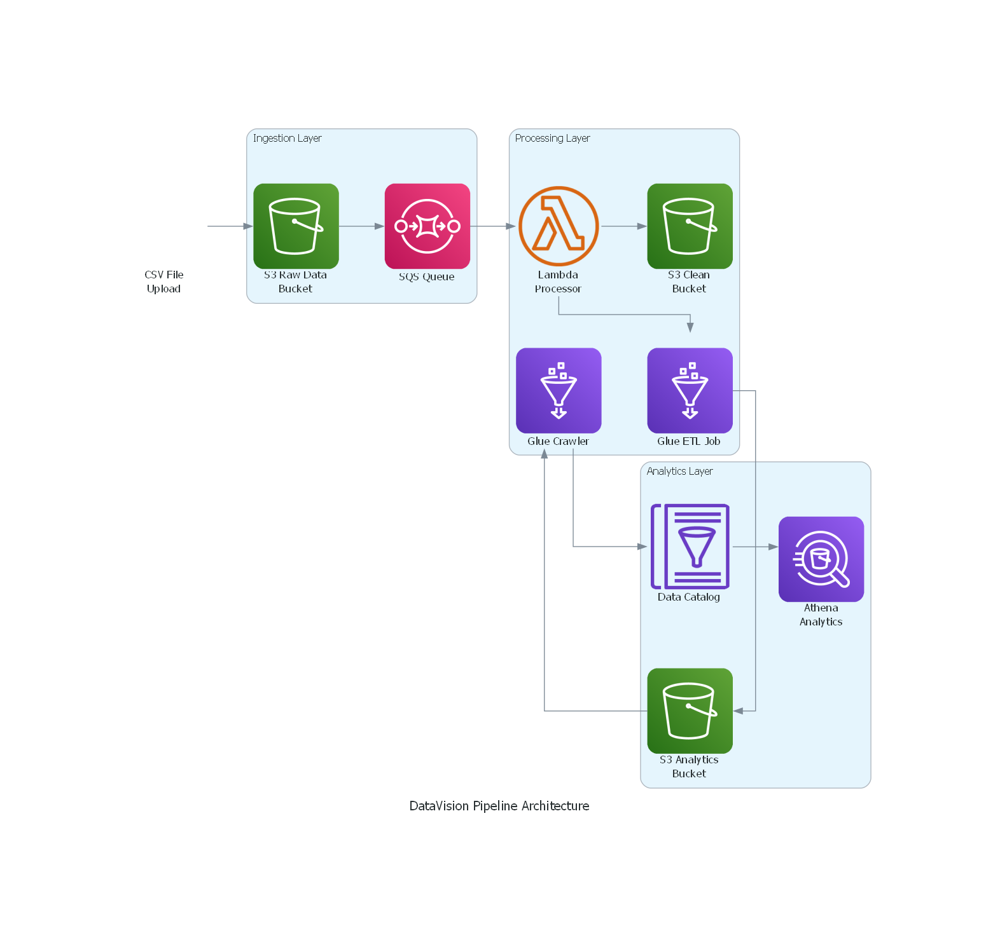

# DataVision Pipeline

A secure, validated, and scalable serverless CSV processing pipeline built with AWS SAM that automatically processes, validates, and transforms CSV data using AWS Lambda, S3, Glue, and Athena.

## 🏗️ Architecture

The DataVision Pipeline follows a serverless event-driven architecture:



### Components

- **S3 Buckets**: Raw data storage, cleaned data, analytics output, and Glue scripts
- **SQS Queue**: Decouples S3 events from Lambda processing
- **Lambda Functions**: CSV validation, cleaning, and orchestration
- **AWS Glue**: ETL jobs for data transformation
- **Glue Crawler**: Automatic schema discovery and catalog updates
- **Amazon Athena**: SQL queries on processed data

## ✨ Features

- **Automated Processing**: Event-driven pipeline triggered by CSV uploads
- **Data Validation**: Schema validation using Zod with email and date format checks
- **Data Cleaning**: Filters invalid records and ensures data quality
- **Scalable Architecture**: Serverless components that scale automatically
- **Cost Effective**: Pay-per-use pricing model
- **Monitoring**: Built-in logging and error handling

## 📋 Prerequisites

- AWS CLI configured with appropriate permissions
- SAM CLI installed
- Node.js 22.x
- Docker (for local testing)

## 🚀 Quick Start

### 1. Clone and Install Dependencies

```bash
git clone <repository-url>
cd "DataVision Pipeline"
npm install
```

### 2. Deploy the Pipeline

```bash
# Build the application
sam build

# Deploy with guided setup
sam deploy --guided
```

During deployment, you'll be prompted for:
- **Stack Name**: Choose a unique name (e.g., `datavision-pipeline-dev`)
- **AWS Region**: Your preferred region
- **Confirm changes**: Review changes before deployment
- **IAM role creation**: Allow SAM to create necessary IAM roles

### 3. Upload Glue Script

After deployment, upload the transformation script to the Glue scripts bucket:

```bash
aws s3 cp src/transform_csv.py s3://YOUR-STACK-NAME-bembe-glue-scripts/
```

## 📊 Data Schema

The pipeline expects CSV files with the following structure:

```csv
id,name,email,score,date
1,John Doe,john@example.com,85,12/8/2024
```

### Validation Rules

- **id**: Non-empty string
- **name**: Non-empty string  
- **email**: Valid email format
- **score**: Numeric string (≥0)
- **date**: Valid date format

## 🔄 How It Works

1. **Upload**: Drop CSV files into the raw data S3 bucket
2. **Trigger**: S3 event sends message to SQS queue
3. **Process**: Lambda function validates and cleans the data
4. **Transform**: Glue job filters records with score ≥ 50
5. **Catalog**: Crawler updates the Glue Data Catalog
6. **Query**: Use Athena to analyze the processed data

## 📁 Project Structure

```
DataVision Pipeline/
├── src/
│   ├── rawCsvProcessor.ts      # Main CSV processing Lambda
│   ├── triggerCrawler.ts       # Crawler trigger function
│   ├── runAthenaQuery.ts       # Athena query execution
│   ├── transform_csv.py        # Glue ETL script
│   └── s3-notification-handler.ts # S3 notification setup
├── events/
│   └── event.json             # Sample test event
├── template.yml               # SAM template
├── samconfig.toml            # SAM configuration
├── package.json              # Node.js dependencies
└── data.csv                  # Sample data file
```

## 🧪 Testing

### Local Testing

```bash
# Test individual Lambda function
sam local invoke RawCsvProcessorFunction --event events/event.json

# Start local API
sam local start-api
```

### Upload Test Data

```bash
# Upload the sample CSV file
aws s3 cp data.csv s3://YOUR-STACK-NAME-bembe-raw-data/input/
```

## 📈 Monitoring

Monitor your pipeline through:

- **CloudWatch Logs**: Lambda function execution logs
- **CloudWatch Metrics**: Function invocations, errors, duration
- **S3 Metrics**: Object counts and storage usage
- **Glue Console**: Job run history and status

## 🔍 Querying Data

Once data is processed, query it using Athena:

```sql
-- Average scores by name
SELECT name, AVG(CAST(score AS INTEGER)) as avg_score
FROM analytics_final
GROUP BY name
ORDER BY avg_score DESC;

-- High performers (score >= 80)
SELECT name, email, score
FROM analytics_final
WHERE CAST(score AS INTEGER) >= 80;
```

## 🛠️ Configuration

### Environment Variables

The Lambda functions use these environment variables:

- `CLEAN_BUCKET`: S3 bucket for cleaned data
- `GLUE_JOB_NAME`: Name of the Glue transformation job
- `CRAWLER_NAME`: Name of the Glue crawler

### Customization

To modify the data transformation logic:

1. Edit `src/transform_csv.py` for Glue job changes
2. Update `src/rawCsvProcessor.ts` for validation rules
3. Modify the schema in the validation section

## 🚨 Troubleshooting

### Common Issues

**Lambda Function Timeouts**
- Increase timeout in `template.yml`
- Check CloudWatch logs for performance bottlenecks

**Glue Job Failures**
- Verify the Python script is uploaded to the scripts bucket
- Check Glue job logs in CloudWatch

**Permission Errors**
- Ensure IAM roles have necessary S3 and Glue permissions
- Verify bucket policies allow cross-service access

### Debugging

```bash
# View Lambda logs
sam logs -n RawCsvProcessorFunction --stack-name YOUR-STACK-NAME --tail

# Check Glue job status
aws glue get-job-runs --job-name transformCsvJob
```

## 🧹 Cleanup

To remove all resources:

```bash
sam delete --stack-name YOUR-STACK-NAME
```

**Note**: Manually delete S3 buckets if they contain data, as CloudFormation won't delete non-empty buckets.

## 📚 Additional Resources

- [AWS SAM Documentation](https://docs.aws.amazon.com/serverless-application-model/)
- [AWS Glue Developer Guide](https://docs.aws.amazon.com/glue/)
- [Amazon Athena User Guide](https://docs.aws.amazon.com/athena/)
- [AWS Lambda Best Practices](https://docs.aws.amazon.com/lambda/latest/dg/best-practices.html)

## 🤝 Contributing

1. Fork the repository
2. Create a feature branch
3. Make your changes
4. Add tests if applicable
5. Submit a pull request

## 📄 License

This project is licensed under the ISC License - see the package.json file for details.